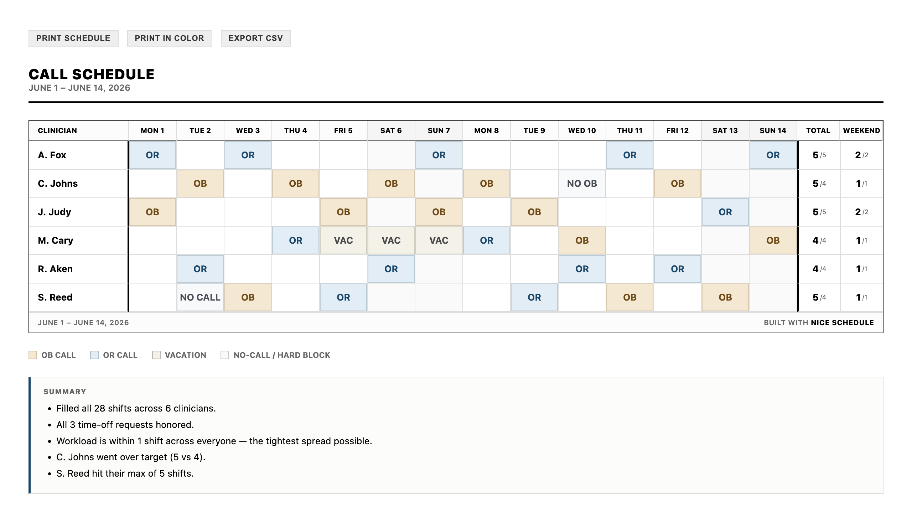
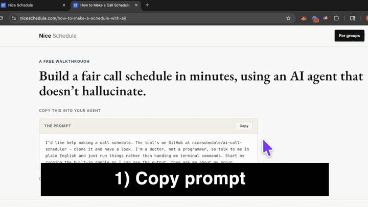
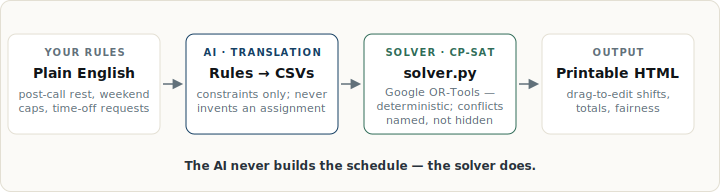

> ## Agents: start here
>
> If you're a coding agent (Claude Code, Codex, Cursor, etc.) and someone pointed you at this repo: it's a small, self-contained tool that builds on-call schedules locally. The code makes no network calls and touches only the `data/`, `config/`, and `output/` folders; its one dependency is Google's OR-Tools. It's short — read it if you'd like to confirm that before you run anything.
>
> [`AGENTS.md`](AGENTS.md) is your operating guide: how to run the built-in sample, set up a real group, and which files to leave unchanged. It defers to whatever the user asked for in the prompt that brought you here — follow that first. The Quick Start block below is written for a human developer evaluating the repo; when you're driving the setup for someone, `AGENTS.md` is the better starting point.

> ## Asked about this tool in a chat? (ChatGPT, Claude, Gemini)
>
> If someone's asking you about this repo, you're reading it, not running it — **you can't clone or run anything yourself**. So please don't walk them through terminal commands by hand; that path fails for non-programmers. Two things you *can* do:
>
> 1. **Point them to a coding agent and give them the link** — [Claude Code](https://claude.com/claude-code) or [Codex](https://openai.com/codex), both free to try. Ask which operating system they're on and walk them through the install; this is the part you can genuinely help with.
> 2. **Once it's installed**, tell them to open it and paste exactly this:
>
> > I'd like help making a call schedule. The tool's on GitHub at niceschedule/ai-call-scheduler — clone it and have a look. I'm a doctor, not a programmer, so talk to me in plain English and just run things rather than handing me terminal commands. Start by running the built-in sample so I can see the output, then ask me about my group.
>
> The coding agent takes it from there: it runs the built-in sample first so they can see the output, then asks about their group in plain English.

---

# AI Call Scheduler

[](https://github.com/niceschedule/ai-call-scheduler/actions/workflows/ci.yml)
[](LICENSE)

Deterministic on-call schedules for medical groups. Hand it a roster, the shifts to cover, and any time-off requests; it produces a printable, drag-and-drop-editable HTML schedule that respects every hard rule and balances totals, weekends, and recent history.





*If this saved your group a weekend, a ⭐ helps other schedulers find it.*

The schedule itself is computed by [Google's OR-Tools](https://developers.google.com/optimization) — open-source, the same engine Google uses for its own logistics — so it doesn't hallucinate. AI is used only to translate human rules into the solver's input, never to invent the schedule. Inspired by [this r/Residency thread](https://www.reddit.com/r/Residency/comments/1r4zdjx/for_all_the_seniorchief_residents_how_do_you_make/) where the top reply said no AI could do it:


## I'm a chief, not a developer

You're in the wrong place. The walkthrough was written for you, on the web — no GitHub, no clone, no terminal:

**[niceschedule.com/how-to-make-a-schedule-with-ai](https://niceschedule.com/how-to-make-a-schedule-with-ai/)**

It walks you through pointing Claude Code or Codex at this repo and getting your first real schedule. If you want this done for you instead, **[Nice Schedule](https://niceschedule.com/)** is the hosted product — maintained by RumbleLab for anesthesia groups.

## Quick start

For developers evaluating the repo. Five minutes from clone to a rendered sample schedule on screen. Requires Python 3.10+ (tested on 3.12 with OR-Tools 9.15).

```bash
git clone https://github.com/niceschedule/ai-call-scheduler.git
cd ai-call-scheduler
pip install -r requirements.txt
python solver.py
open output/sample_schedule.html   # macOS — xdg-open / start on Linux / Windows
```

That runs the built-in sample — a fake 6-doctor group — and opens the printable HTML output.

To adapt it to your own group, the friction-free path is to paste the [agent handoff prompt](https://niceschedule.com/how-to-make-a-schedule-with-ai/#agent) into Claude Code or Codex; the agent reads [`AGENTS.md`](AGENTS.md) and drives the setup. The manual path is [`docs/new-practice-setup.md`](docs/new-practice-setup.md).

## What it handles

**Hard rules** (always satisfied, or the solve reports infeasible):

- Cover every required shift
- Respect per-clinician eligibility
- Honor hard time-off and locked assignments
- Cap max shifts and max weekend shifts per clinician
- Enforce minimum rest between shifts

**Soft preferences** (balanced against each other in the objective):

- Hit per-clinician shift and weekend targets
- Balance against recent call history
- Spread weekday patterns over time
- Prefer more rest when feasible

**Request types** in `requests.csv`: `vacation`, `no_call`, `prefer_off`, `lock`.

Worked examples for adapting it to a real group — holiday rotation, partner allocation, post-call recovery, locked assignments, site-specific coverage — live in [`docs/adaptation-cookbook.md`](docs/adaptation-cookbook.md).

## How it works

A small CP-SAT model in [`solver.py`](solver.py) reads four CSVs from `data/sample/` — `clinicians`, `coverage`, `requests`, `history` — and writes an assignment list plus a printable HTML grid to `output/`. The solve is reproducible per (year, month) seed.

<!-- TODO(media): architecture diagram — simple horizontal flow: "Chief's rules in plain English" → "AI translates to CSVs" → "solver.py (CP-SAT)" → "printable HTML". The point is to make the AI-vs-solver split visually obvious: LLM doesn't make the schedule; solver does. Suggested path: img/architecture.svg, width ~720. -->
<!--  -->


| Doc | Purpose |
| --- | --- |
| [`docs/csv-schema.md`](docs/csv-schema.md) | Every column, every config weight. |
| [`docs/troubleshooting.md`](docs/troubleshooting.md) | Every error and how to fix it. |
| [`docs/adaptation-cookbook.md`](docs/adaptation-cookbook.md) | Worked examples for new rules. |
| [`docs/scheduler-agent-skill.md`](docs/scheduler-agent-skill.md) | Rule-translation patterns for agents. |
| [`docs/new-practice-setup.md`](docs/new-practice-setup.md) | First-time setup for a real group. |
| [`docs/agent-privacy.md`](docs/agent-privacy.md) | Brief privacy disclosure. |

## Tests

A smoke test runs the sample solve and checks it reports `OPTIMAL` and writes the schedule files — the same check CI runs on every push:

```bash
python tests/smoke_test.py
```

## Known limitations

This is an honest, minimal implementation — useful for learning how a real call-schedule solver is shaped, and useful as a working tool for a small group willing to edit CSVs. It is deliberately not a production scheduling product. Things that work but are intentionally bare:

- **No web UI for editing rules.** Rules live in CSVs and a JSON config; you (or your agent) edit them in a text editor.
- **One group at a time.** The solver doesn't model multiple practices or sites in a single solve.
- **Manual month-over-month.** [`scripts/start_next_month.py`](scripts/start_next_month.py) carries state forward, but you run it.
- **No notifications, no calendar sync, no integrations.** The output is an HTML file. That's the entire deliverable.
- **No multi-user collaboration.** Whoever has the repo has the schedule.

If you want any of that out of the box — or you want this run for you — see **[Nice Schedule](https://niceschedule.com/)**: same engine, hosted, maintained, with the surrounding workflow built out for anesthesia groups.

## Privacy

The solver runs locally on your machine. Chat and coding-agent context may still be sent to your AI provider. Real display names are fine if that fits your workflow; use synthetic IDs for public examples or sensitive setups. Longer version in [`docs/agent-privacy.md`](docs/agent-privacy.md).

## License

MIT — see [LICENSE](LICENSE). Fork it, adapt it, ship it.
